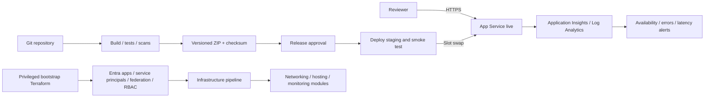

# Octo — .NET delivery on Azure

A small DevOps interview exercise: a stateless .NET 10 service, modular Terraform, Azure DevOps pipelines, release verification, and recovery. The design emphasizes understandable controls within a 2–3 hour implementation scope.

**Repository:** [boscodalglish/octopus](https://github.com/boscodalglish/octopus), private. **Deployment status:** no Azure resources were created and no pipelines were run in Azure DevOps. There is no deployed application URL. See [validation evidence](docs/validation.md) for what was actually tested locally.

## Run locally

Prerequisites: .NET SDK **10.0.401** (or a compatible later patch), Python 3, and Bash for the scripts. Terraform **1.12.2** is needed for infrastructure validation. Dependency downloads require internet access; local execution does not require Azure credentials.

```bash
dotnet restore Octo.slnx --locked-mode
dotnet run --project src/Octo.Api --no-launch-profile --urls http://127.0.0.1:5080
```

Open [http://127.0.0.1:5080](http://127.0.0.1:5080). In another terminal:

```bash
python3 scripts/smoke-test.py http://127.0.0.1:5080 local --attempts 1
bash scripts/validate-local.sh
```

The validation script only builds/tests code, downloads dependencies/providers if absent, validates Terraform, and runs mocked provider tests. It does **not** authenticate to Azure, plan against real infrastructure, or apply changes.

## Architecture



- `GET /` explains the demonstration.
- `GET /api/info` reports service, version, and embedded commit identity.
- `GET /health` reports health without external dependencies.
- No database, business secrets, personal data, or company configuration.

## What is included

| Requirement | Implementation |
|---|---|
| CI/CD | [Application pipeline](pipelines/application.yml), reusable templates, build/test/scan artifacts, approved release, staging smoke test, slot swap, recovery |
| Infrastructure as code | [Bootstrap](infrastructure/bootstrap) and [demo environment](infrastructure/environments/demo), six reusable modules and provider lockfiles |
| Identity as code | Entra registrations, service principals, exact service-connection federation, runtime managed identities, scoped role assignments |
| Governance as code | Azure DevOps pipeline definitions, environment approvals, branch protection, explicit pipeline authorization and connection locks |
| Observability | Application Insights SDK, JSON console logs, workspace, workbook, HTTP error/latency alerts, standard availability test and action group |
| Security | HTTPS, disabled basic publishing, secretless deployment federation, dependency auditing, Trivy scanning, protected state and documented exception |
| Operations | [Release script](scripts/release.sh), exact-version smoke tests and [incident/rollback runbook](docs/operations.md) |
| Platform engineering | Versionable modules and templates, documented [IDP evolution](docs/architecture.md#platform-engineering) |

## Decisions and limits

**App Service instead of AKS:** one stateless .NET application does not justify cluster provisioning, upgrades, ingress, pod security and Kubernetes operations in this exercise. ZIP deployment also avoids adding a container registry and an image supply chain. There is intentionally **no Dockerfile** because this solution does not use containers. A future container variant would build once, scan/sign an image and promote its immutable digest; AKS would only be introduced for a justified platform requirement.

**Staging and live are slots in one demo environment.** They share an S1 plan, network and telemetry destination. They demonstrate safe release mechanics, not production isolation or high availability. Real nonproduction and production need separate resource boundaries, identities, state and approvals.

**No Key Vault is provisioned:** the application needs no secrets. Managed identities are created, but have no data-access roles. [Security notes](docs/security.md) explain how Key Vault would be added when a genuine secret is needed.

**Public endpoints:** the app, staging and SCM endpoints are publicly reachable for this synthetic demo, with HTTPS and Entra-authorized deployment. VNet integration controls outbound connectivity and does not make inbound access private. State storage also remains publicly reachable for hosted pipeline agents; one scoped, expiring scanner exception documents this trade-off.

**Costs:** S1 hosting is paid even when idle. Log ingestion, state storage and standard availability tests also incur costs. Single-region, one-worker hosting has no production availability claim. See [setup and cleanup](docs/setup.md).

**Governance assumptions:** an existing authorized operator bootstraps an existing personal/test tenant, subscription and Azure DevOps project/repository. An independent reviewer is needed. Exact bootstrap privileges, state migration, first-deployment behavior and remaining provider/runtime verification are documented in [setup](docs/setup.md).

## Review guide

1. [Architecture and identity flow](docs/architecture.md)
2. [Setup, bootstrap and future deployment](docs/setup.md)
3. [Security and governance](docs/security.md)
4. [Operations and rollback](docs/operations.md)
5. [Validation evidence and submission checklist](docs/validation.md)
6. [AI assistance disclosure](docs/ai-assistance.md)
7. [Acceptance criteria review](docs/acceptance-review.md)
