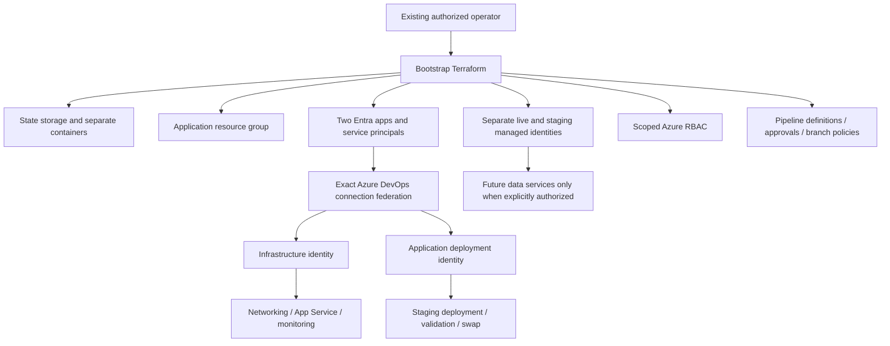

# Architecture and technical judgement

## Runtime

A .NET 10 application runs on Linux Azure App Service. The application is stateless and returns only synthetic demonstration information. Azure terminates HTTPS; local development uses loopback HTTP. App Service enforces HTTPS and TLS 1.2 for both app and SCM endpoints. FTP and basic publishing credentials are disabled.

The S1 plan supports a staging deployment slot. Both slots are always on and have `/health` checks. Deployment uploads the tested ZIP to staging; no build occurs in Azure. Slot swap promotes that deployment. Managed identities remain attached to their slots, and environment/telemetry settings are marked sticky.

The delegated `/26` subnet provides space for App Service integration and scaling. An NSG denies Internet-originated subnet ingress. **This NSG does not protect the public App Service endpoint.** Integration is outbound and there are no private application dependencies in this demo. No claim of restricted Internet egress is made; production would require route-all, appropriate routing/firewall controls, private service endpoints and DNS.

## Identity and bootstrap flow

Terraform cannot create its own initial authority. The first executor is an existing authorized operator. Bootstrap executes through Azure CLI/user authentication and separately authorized Azure DevOps provider credentials. This is a privileged provisioning process, not a daily application pipeline.

| Principal | Azure access | Entra administration | Purpose |
|---|---|---|---|
| Bootstrap operator | Resource creation/provider registration at subscription scope; role-assignment authority; state access | Authority to create/manage the deployment apps and service principals | Create and maintain the foundation |
| Infrastructure service principal | Contributor on the application resource group; Blob Data Contributor on the **platform container only** | None granted | Manage application infrastructure and its state |
| Application service principal | Website Contributor on the application resource group | None granted | Deploy and swap web app releases |
| Runtime live/staging identities | No data-access roles | Azure manages their underlying service principals | Future passwordless service access |

Website Contributor is a pragmatic built-in role for this exercise and still permits web configuration changes. Production should consider a tested custom deployment role scoped to the individual web app after it exists. Contributor is also broad: the infrastructure pipeline can change application configuration. Approvals, branch policy and administrator separation are important trust boundaries; these identities are not sandboxed from their managed application.

Bootstrap owns role assignments. The routine infrastructure pipeline cannot grant Azure roles or create Entra app registrations. Any new runtime access is added as a reviewed bootstrap/module change. If the bootstrap is moved to automation, its Entra permissions and RBAC authority need a separately protected identity-management pipeline.

## State and module boundaries

- `foundation`: resource-provider registrations, two resource groups, state storage/containers, bootstrap state access, runtime identities.
- `deployment-identity`: Entra application, service principal, Azure DevOps service connection, federated credential and explicit role assignments.
- `delivery-governance`: pipeline definitions and variables, environments, approvals, branch policies, connection locks and pipeline authorizations.
- `networking`: VNet, delegated subnet and NSG.
- `web-app`: S1 plan, web app and slot.
- `monitoring`: workspace, Application Insights, diagnostic settings, workbook, probes and alerts.

Bootstrap and platform state use different containers and separate state keys. The infrastructure pipeline cannot read the bootstrap container. Blob leases provide Terraform locking, with versioning and retention for recovery. State, saved plans and telemetry connection strings must be treated as restricted artifacts even though the application has no business secrets.

The monitoring workspace/Application Insights are created before app settings consume their connection string. Alerts, diagnostic settings and the availability probe depend on the web app. Terraform can resolve these resource-level dependencies; avoid adding a blanket mutual module `depends_on`, which would create a cycle.

## Release control

One release stage holds the service-connection exclusive lock through staging deployment, verification, swap and any recovery. This avoids one release overwriting another's staging slot while promotion waits. The environment approval happens **before this entire stage**, not between staging and live. A post-staging approval could be added as an agentless job inside the same locked stage; splitting into unlocked stages would introduce a slot race.

Infrastructure has a saved-plan stage followed by an independently approved apply stage. Apply uses the saved plan from the same run; a stale plan fails instead of being silently regenerated. The privileged bootstrap is deliberately excluded from these routine pipelines.

## Platform engineering

This can become a versioned service template with application skeleton, CI templates, Terraform modules, health contract, ownership tags, default telemetry and runbooks. A developer supplies a service name and environment configuration; a platform workflow provisions the approved foundation and returns URLs and dashboards.

Before organization-wide use: publish versioned modules, add module contract tests and policy checks, centralize protected pipeline templates, offer private-agent environments, define supported runtime upgrade policy, register ownership in a service catalog, and automate evidence retention. A portal is optional; consistent supported interfaces and a clear ownership model are the initial IDP value.
